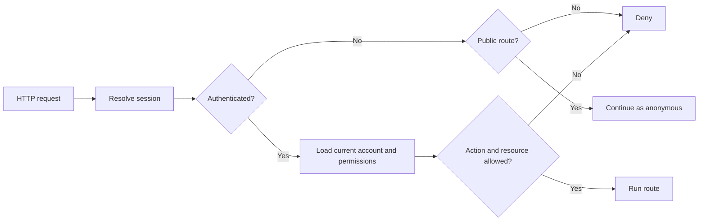

# Authentication and authorisation design

Status: Partial design for GitHub issue #11
Prepared: 20 September 2026
Decision state: Security seam and recommended local-prototype mechanism proposed; roles and account workflow are unapproved.

## Scope

This design covers local username/password authentication, server-side sessions and server-enforced permissions for the AITrace prototype. It does not provide enterprise SSO, production deployment, MFA, email delivery or account recovery.

Origin and host checks remain defence-in-depth controls. They are not authentication or authorisation.

## Security seam

Application routes should depend on one request-level identity interface:

```js
authenticateRequest(request) -> anonymous | authenticatedPrincipal
authorize(principal, action, resourceContext) -> allow | deny
```

Authentication resolves the current account from a valid server-side session. Authorisation separately decides whether that principal may perform the requested action. The React interface may hide unavailable actions for clarity, but the server decision is authoritative.

All protected routes must use common middleware at this seam. New routes are denied by default until an explicit policy permits them.

## Recommended local-prototype mechanism

### Accounts

Store account identity, login identifier, display name, role identifier, password-hash parameters, lifecycle state and timestamps in SQLite. Store no plaintext or reversibly encrypted password.

The proposal suggests Administrator, Compliance/Governance Officer and Faculty/Staff User, but says the names require sponsor confirmation. Use stable internal role identifiers only after the access matrix is approved; keep display labels configurable.

### Password hashing

OWASP recommends Argon2id and identifies scrypt as the fallback when Argon2id is unavailable. Node 26 provides asynchronous `crypto.scrypt`. If the team approves a no-new-dependency local implementation, use asynchronous scrypt with a unique cryptographic salt, stored algorithm/version parameters and a work factor benchmarked on the supported development machines. The current OWASP minimum scrypt guidance must be rechecked at implementation time.

Verification must use a timing-safe comparison and perform comparable password-hash work for unknown and known accounts. Login failures must use the same generic response.

### Sessions

Use an opaque cryptographically random session identifier containing at least 128 bits of entropy. Store only a hash of that identifier in SQLite with account ID, creation time, last-used time, absolute expiry and revocation time.

Send the identifier in a host-only cookie with:

- `HttpOnly`;
- `SameSite=Strict` unless an approved flow requires otherwise;
- `Path=/`;
- no `Domain` attribute;
- `Secure` whenever HTTPS is used.

The current local HTTP prototype cannot provide production transport security. Authentication over plain HTTP must remain limited to loopback demonstration and must not be described as production-safe.

Create a new identifier after successful login or any privilege change. Logout revokes the server-side session and expires the cookie. Never put session identifiers in URLs, logs, localStorage or sessionStorage.

## Proposed route surface

| Method and route | Purpose | Access |
| --- | --- | --- |
| `POST /api/auth/login` | Verify credentials and create a session | Anonymous |
| `POST /api/auth/logout` | Revoke current session and expire cookie | Authenticated |
| `GET /api/auth/session` | Return current principal and permitted UI capabilities | Anonymous or authenticated |

Registration, invitations, account administration, password change/recovery and role assignment are deliberately excluded until their workflows and permissions are approved.

## Permission model

Define permissions as actions on resources rather than spreading role-name comparisons across routes. Candidate action identifiers include:

- `registry:read`;
- `registry:create`;
- `registry:update`;
- `assessment:submit`;
- `assessment:review`;
- `approval:decide`;
- `action:manage`;
- `report:export`;
- `account:manage`.

These identifiers are a design vocabulary, not an approved access matrix. Each route must map to an approved action and, where necessary, a resource-level rule such as ownership or institutional scope.

## Deny-by-default request flow



Disabled or deleted accounts invalidate existing sessions because each request resolves current persisted account state.

## Error and response rules

- Use one generic login failure for an unknown account, incorrect password, disabled account or other rejected credentials.
- Do not reveal whether a login identifier exists through response body, status differences or a quick-exit code path.
- Return `401` when authentication is required and absent/invalid.
- Return `403` when an authenticated principal lacks permission.
- Do not return password hashes, session hashes or security parameters through the API.
- Apply existing host, origin, content-type and body-size checks to authentication writes.
- Add rate limiting or another approved automated-attack control before any non-loopback deployment.

## Persistence boundaries

A future migration will need separate tables for accounts, role/permission assignments and sessions. It may later need invitations, password history/recovery, account events and permission-change audit records.

Authentication history is not the same as the governance audit history required for AI records and assessments. Retention and access rules for both need explicit decisions.

## Test requirements

API/integration checks must cover:

- correct and incorrect credentials with generic failures;
- unknown, disabled and deleted accounts;
- slow salted hash verification and stored algorithm parameters;
- session creation, rotation, expiry, revocation and logout;
- missing, malformed, expired and revoked cookies;
- default denial for every protected route;
- every approved role/action combination;
- horizontal access attempts against another owner's resource;
- current persisted account/role state on each request;
- origin/content-type protections on login and logout;
- no credential or session material in API bodies, logs or browser storage.

Browser checks must cover keyboard-accessible login, clear session state, logout, expired-session handling and role-appropriate navigation without treating hidden controls as security enforcement.

## Decisions required before implementation

1. Confirm role names and the permission/resource matrix.
2. Decide whether accounts are invited, administered, self-registered or pre-seeded for demonstration.
3. Decide how the first administrator is created without a committed default password.
4. Approve login identifier requirements and password policy.
5. Approve session idle and absolute lifetimes.
6. Decide whether scrypt through built-in Node crypto is acceptable or an Argon2id dependency/identity provider is required.
7. Define password change, recovery, account disabling and role-change workflows.
8. Define production HTTPS and deployment expectations.
9. Approve audit and retention requirements.

No authentication tables or routes should be added until at least decisions 1–6 are recorded.

## References

- OWASP. [Authentication Cheat Sheet](https://cheatsheetseries.owasp.org/cheatsheets/Authentication_Cheat_Sheet.html).
- OWASP. [Authorization Cheat Sheet](https://cheatsheetseries.owasp.org/cheatsheets/Authorization_Cheat_Sheet.html).
- OWASP. [Password Storage Cheat Sheet](https://cheatsheetseries.owasp.org/cheatsheets/Password_Storage_Cheat_Sheet.html).
- OWASP. [Session Management Cheat Sheet](https://cheatsheetseries.owasp.org/cheatsheets/Session_Management_Cheat_Sheet.html).
- Node.js. [Crypto documentation](https://nodejs.org/api/crypto.html).
- MDN. [Secure cookie configuration](https://developer.mozilla.org/en-US/docs/Web/Security/Practical_implementation_guides/Cookies).

Sources checked on 20 September 2026.
