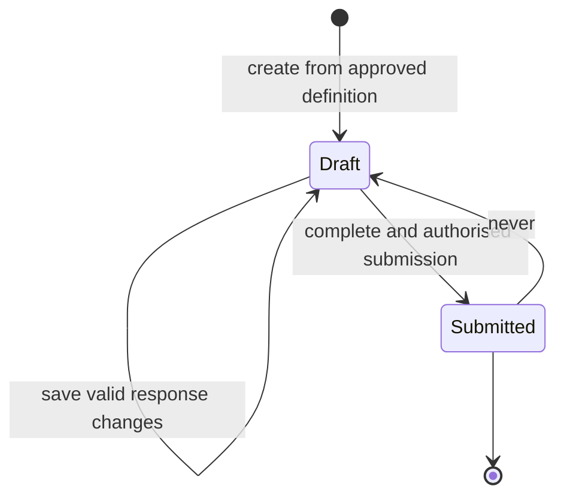

# Governance assessment module design

Status: Partial design for GitHub issue #14
Prepared: 20 September 2026
Decision state: Assessment lifecycle and module seam proposed; questionnaire content and permissions are unapproved.

## Purpose

The assessment module will present an approved, versioned questionnaire for a registered AI use, preserve draft responses and submit an immutable response set for deterministic evaluation.

It will not define governance questions, calculate risk, approve an AI use or assert compliance.

## Module seam

The application should use a small lifecycle interface:

```js
createAssessment({ aiUseId, definitionVersion, actor }) -> assessment
saveResponses({ assessmentId, expectedRevision, changes, actor }) -> assessment
submitAssessment({ assessmentId, expectedRevision, actor }) -> submission
```

The module owns lifecycle rules, question applicability, response validation, optimistic concurrency, completeness and immutable submission. The scoring module consumes the completed submission through its separate interface.

## Lifecycle



A submitted assessment is immutable. A later reassessment creates a new assessment linked to the previous one and an explicit reason, such as scheduled review, material change or corrected institutional instruction.

## Definition requirements

An assessment can start only from an approved, immutable questionnaire definition containing:

- stable definition and version identifiers;
- source and institutional interpretation references;
- applicable categories and conditions;
- ordered sections and stable question identifiers;
- approved labels, help text and evidence guidance;
- response type and permitted values;
- required/optional status and applicability rules;
- effective date and approval record.

Questionnaire definitions must not be embedded directly in React code or overwritten after use.

## Draft behaviour

- Save only response changes known to the selected definition version.
- Validate response type and permitted values on every save.
- Preserve unanswered questions without inferring an answer.
- Return field-level validation findings for the interface.
- Use an expected revision to prevent one browser session silently overwriting another.
- Record the actor and timestamp for changes once the role/audit model is approved.
- Do not call the scoring module for incomplete drafts.

## Submission invariants

1. The AI-use record exists and is visible to the actor.
2. The definition version is approved and applicable to that record.
3. Every applicable required question has a valid response.
4. Evidence requirements are satisfied or explicitly represented according to approved policy.
5. The expected revision matches current persisted state.
6. The actor has the approved submit permission.
7. Submission atomically freezes the definition version and response set.
8. Submission does not create an approval decision.

If an invariant fails, no partial submission or risk result is created.

## Scoring handoff

After successful submission, an application adapter passes the approved definition, immutable responses and allowed context to:

```js
evaluateAssessment(definition, responses, context)
```

The resulting evaluation is persisted separately with its trace. Assessment submission and scoring-result persistence should occur in one controlled transaction or a recoverable workflow so a submitted assessment cannot appear evaluated when result storage failed.

## Interface requirements

The future React flow must provide:

- section and progress context without implying a score;
- visible required/optional labels;
- plain-language question help and source context where approved;
- keyboard-operable controls and error summary links;
- saved-draft and conflict feedback;
- review-before-submit screen;
- explicit statement that submission is not approval or compliance certification;
- confirmation naming the questionnaire version submitted;
- safe expired-session handling without losing unsaved text where feasible.

Conditional questions must remain understandable when they appear or become not applicable. Hidden responses must not silently affect evaluation.

## Persistence boundaries

A future migration will need versioned questionnaire definitions, question definitions, assessment instances, draft responses and immutable submissions. Evaluation results, approval decisions, evidence metadata and audit events remain separate records.

Retention, access, evidence handling and audit requirements require approval before schema implementation.

## Error modes

- registry record not found or not visible;
- definition missing, unapproved, retired or inapplicable;
- unknown question or unsupported response;
- missing required response;
- unmet evidence requirement;
- stale revision conflict;
- actor lacks permission;
- definition inconsistency;
- submission transaction or scoring handoff failure.

Errors must preserve the draft when safe and must never infer a favourable response or risk result.

## Test strategy

Tests should cover:

- creation only from an approved applicable definition;
- draft save/reload and field validation;
- conditional applicability and removal of hidden-response influence;
- incomplete-submission rejection;
- stale-revision conflict;
- permission denial on create, view, edit and submit;
- immutable submitted responses;
- reassessment as a new linked instance;
- exact definition-version retention;
- atomic or recoverable scoring handoff;
- accessible keyboard and validation flows in the browser;
- explicit separation of submission, risk result and approval.

## Decisions required before implementation

1. Approve questionnaire sources, questions, help text and response types.
2. Approve category-specific applicability and required evidence.
3. Confirm who may create, edit, view and submit assessments.
4. Approve draft retention and reassessment rules.
5. Approve evidence storage/access design.
6. Approve the scoring definition and handoff behaviour.
7. Approve audit-history and correction requirements.

Until these decisions are recorded, the application must continue to show **Not assessed** and must not expose a placeholder questionnaire that users could mistake for institutional policy.
