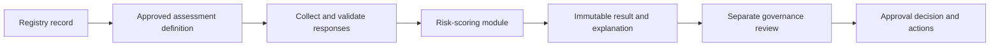

# Explainable risk-scoring module design

Status: Partial design for GitHub issue #9
Prepared: 20 September 2026
Decision state: Module seam and invariants proposed; questions, rules, labels and thresholds are unapproved.

## Purpose

The risk-scoring module will evaluate a completed governance assessment against one approved, versioned definition. It will return a deterministic result and trace explaining which responses and rules produced that result.

The module will not decide whether an AI use is approved, legally compliant or suitable for deployment. Those are separate institutional decisions.

## Design constraints

- Every question, rule and explanation must trace to an approved source and institutional interpretation.
- The exact rule-set version used for an assessment must remain recoverable.
- The same definition and responses must always produce the same result.
- Draft definitions must never produce official results.
- Missing or invalid responses must not silently become low risk.
- Risk, approval and compliance terminology must remain separate.
- No machine learning or free-text model decides the result.
- Current records remain **Not assessed** until an approved definition exists.

## Module seam

The module should expose one interface to the application and its tests:

```js
evaluateAssessment(definition, responses, context) -> evaluation
```

The interface accepts data and returns data. It does not read SQLite, call HTTP endpoints, mutate registry records, render text into the UI or write audit events. Adapters on either side of the seam will load approved definitions, collect responses and persist the returned evaluation.

This gives the module depth: validation, rule ordering, deterministic evaluation, explanation assembly and completeness checks remain behind one interface.

## Input contract

### Definition

An evaluation definition must carry:

- stable definition identifier;
- immutable version identifier;
- lifecycle state such as draft, approved or retired;
- effective date and approval record;
- source references and institution-approved interpretations;
- question definitions with stable identifiers and permitted response shapes;
- deterministic rules;
- outcome identifiers and approved display text;
- explanation templates tied to rules;
- applicability conditions for education, administration and research.

The module must reject a definition that is not approved, is internally inconsistent or lacks required traceability.

### Responses

Responses must be keyed by stable question identifier. Each response must match the corresponding question's permitted response shape. Unknown, duplicate, malformed or missing required responses produce validation findings rather than an inferred outcome.

### Context

Context contains only approved evaluation inputs that are not questionnaire responses, such as the registered use category or definition-effective date. It must not include mutable UI state or database handles.

## Output contract

An evaluation returns either a completed result or validation findings.

A completed result contains:

- definition identifier and immutable version;
- evaluated timestamp supplied by the caller or a documented clock adapter;
- stable outcome identifier and approved display label;
- triggered rule identifiers in deterministic order;
- response identifiers used by each triggered rule;
- source references supporting each rule;
- plain-language explanation fragments;
- warnings or follow-up indicators defined by the approved rules.

Validation findings contain stable codes, affected identifiers and plain-language messages. They do not include a risk result.

## Invariants

1. Only an approved definition can produce a completed result.
2. Each completed result names exactly one immutable definition version.
3. Every triggered rule traces to at least one source reference and the responses it evaluated.
4. Rule priority and tie handling are explicit in the definition.
5. Input order does not change the result or explanation order.
6. Unknown inputs fail validation.
7. An incomplete assessment has no risk outcome.
8. Approval state is never derived from the risk outcome.
9. Compliance is never asserted by the scoring module.

## Persistence boundaries

The database adapter will eventually need separate records for:

- versioned assessment definitions;
- source references and institutional interpretations;
- assessment instances linked to an AI use;
- immutable submitted responses;
- immutable evaluation results and explanation traces;
- separate approval decisions;
- supersession and review history.

Creation and update timestamps on the current `ai_uses` table are not an audit history. No migration should be added until the definition, roles, access rules and retention expectations are approved.

## Application flow



The governance review may consider the risk result, supporting evidence and institutional policy. It remains a separate step and record.

## Error modes

The interface must distinguish:

- invalid definition;
- unapproved definition;
- missing required response;
- malformed or unsupported response;
- unknown question or rule reference;
- ambiguous rule priority;
- no matching outcome;
- internal definition inconsistency.

Configuration faults must fail closed and be visible to authorised maintainers. They must not be translated to a low-risk result.

## Test strategy

Tests should exercise the same interface used by production callers. Once rules are approved, fixtures should cover:

- each approved outcome and its explanation;
- missing, malformed, duplicate and unknown responses;
- rule priority and tie behaviour;
- response ordering independence;
- exact definition-version retention;
- draft and retired definition handling;
- category applicability;
- separation of risk result from approval state;
- regression scenarios for every rule change.

## Scenario templates awaiting decisions

| Scenario | Context | Evidence needed | Expected outcome |
| --- | --- | --- | --- |
| Teaching support using fictional material | Education | Purpose, affected users, data, oversight, disclosure and evaluation evidence | TBD through approved rules |
| Administrative tool processing personal information | Administration | Purpose, personal-information handling, provider access, security, oversight and contestability | TBD through approved rules |
| Research assistant using confidential material | Research | Data authority, confidentiality, integrity, tool terms, human verification and disclosure | TBD through approved rules |
| Material change to a previously assessed AI use | Any | Previous definition/result, changed purpose/model/data and review trigger | TBD through approved rules |

These templates identify information needed for future approval. They are not test fixtures until expected outcomes and their source-derived rationale are approved.

## Decisions required to finish #9

1. Approve the governing framework combination and exact versions.
2. Supply applicable institutional policies and interpretations.
3. Approve questions, permitted responses and required evidence.
4. Define risk outcome labels and their meaning.
5. Approve deterministic rules, priority and thresholds.
6. Approve explanation text for each outcome.
7. Define who approves and changes rule-set versions.
8. Approve example-scenario outcomes.

Until then, this design is implementation-ready at the module seam but has no authorised rule content.
