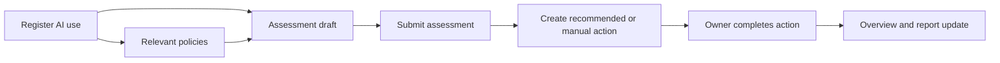

# Product direction — 29 September 2026

## Purpose

This records the product-direction notes gathered before the sponsor showcase. It separates showcase-safe refinements from later capability work so the current local prototype remains demonstrable and its approval boundaries stay clear.

## Immediate UX refinements

- Keep the overview as the main landing page: a point-in-time, actionable view of recorded AI use, draft assessments, outstanding/overdue actions and the user’s due dates.
- Use accordions only for secondary configuration or long supporting content. Main workflow tasks and their current state remain visible.
- Hide a required-field marker as soon as its control has a valid value.
- Reduce persistent-header space while retaining account, theme and sign-out controls. Desktop can use hover affordances; mobile needs an explicit pull-down/menu pattern.
- Replace the standalone **Disclose AI use** navigation item with an entry point in the registry. The registry must retain a clear unreviewed-disclosure queue and provenance.
- Reframe the guide as a workflow walkthrough with scenarios and stories.

## Showcase and next demonstration

1. Use the overview, registry, assessment, action and policy path as the walkthrough.
2. Demonstrate a draft assessment, then submission, action creation, action completion and the resulting dashboard state.
3. Record sponsor feedback after the showcase; keep the sponsor demonstration ticket separate from implementation and UAT tickets.
4. Complete final handover at the end of Week 12 after showcase, walkthrough and feedback.

## Core workflow to validate

The next design decision is whether completed actions only update action status, or also require a reassessment/review checkpoint. That must be agreed with the sponsor before it becomes an automated policy rule.

## Prioritised backlog

| Priority | Outcome | Scope boundary |
| --- | --- | --- |
| P0 | Overview becomes the daily-use dashboard with drafts, outstanding actions, due dates and clear links to next actions. | Build on existing dashboard data; do not invent approved risk policy. |
| P0 | Registry absorbs disclosure. | Preserve staff disclosure provenance, review status and permissions. |
| P0 | Assessment-to-action workflow. | Suggested actions may be created from submitted assessments; retain manual action creation and manager review. |
| P1 | Policies linked by topic to an assessment. | A user can view/select relevant policies and must acknowledge required reading before submission only after sponsor approval of the rule. |
| P1 | Configurable assessment requirements in an administrator UI. | Requires versioning, permissions, audit history and sponsor-approved content; do not expose uncontrolled scoring changes. |
| P1 | Reports portal. | Provide point-in-time, actionable reporting views and exports; do not duplicate the dashboard without a clear audience need. |
| P1 | Workflow walkthrough/visualisation with scenarios. | Begin as a read-only guide; a configurable workflow builder is later work. |
| P2 | Permission administration. | Start with user-based permissions and manager capabilities; adding custom roles requires a migration, role-policy model, audit and security review. |
| P2 | Advanced settings. | Group low-frequency administrative options after the above workflows are stable. |

## Later architecture work

A visual workflow builder and backend-configurable workflow items are useful only after the team validates a small fixed workflow. The design should restrict editing to administrators and explicitly authorised managers, use versioned definitions, validate transitions on the server, keep an audit trail, and preserve previously completed workflow records. It should not allow a UI change to silently rewrite historical assessment or action meaning.

## Decisions needed from sponsor/team

- What counts as excessive or inappropriate AI use, and what evidence supports any percentage-based graph?
- Which policies are mandatory for which assessment topics, and what acknowledgement is sufficient?
- Which actions are automatically suggested, which require manager review, and what happens when they are completed?
- Which manager permissions are required before custom roles are introduced?
- What reports are needed by staff, managers and administrators, and what point-in-time date/filter is meaningful?
- Which workflow scenarios should appear in the walkthrough?
